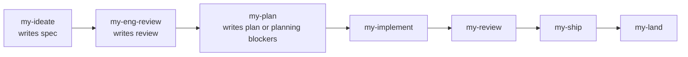
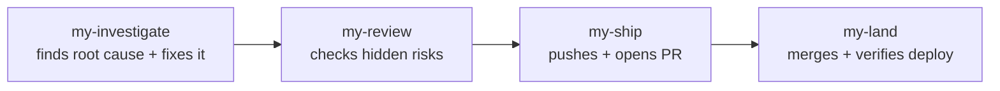
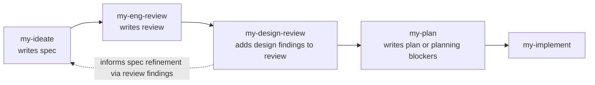

# AI Skills

This repo contains a set of reusable Codex skills that together form a practical product and engineering workflow.

At a high level, the skills cover:

- thinking: shape ideas, challenge scope, and turn vague requests into a concrete spec
- planning: review the spec, pressure-test the approach, and produce an implementation plan or a blocked-planning artifact
- execution: implement work, review the diff, ship it, and land it
- debugging and quality: investigate bugs from root cause, QA flows, and audit design or security
- reflection: look back on what shipped and how the team worked

These skills are designed to be composable rather than mandatory. You do not need to use every skill on every task. The value is in chaining the right ones together for the job.

## Artifact Flow

The workflow is not strictly one-way. Each stage produces a primary artifact, and some
later skills are expected to feed corrections back into earlier artifacts when they
discover drift or missing decisions.

| Skill | Primary artifact | Role | Feeds back into |
| --- | --- | --- | --- |
| `my-ideate` | `specs/` | Owns the product spec and product-intent source of truth. | `specs/` |
| `my-eng-review` | `reviews/` | Owns the engineering review: architecture, risks, tests, and unresolved engineering questions against the spec. | `reviews/` |
| `my-design-review` | `reviews/` | Reviews the spec from a UX/design perspective and records design findings plus unresolved questions in the shared review artifact. | `reviews/` |
| `my-design-audit` | `.qa-reports/` | Report-only audit of implemented UI for visual quality, states, responsiveness, and accessibility. | `.qa-reports/` |
| `my-plan` | `.plans/` or `plans/` | Owns planning readiness and the implementation plan derived from the spec and review. It either writes a full plan or a blocked-planning artifact with routed questions. | `.plans/` |
| `my-implement` | `.plans/` or `plans/` | Updates the plan as work is executed. | `.plans/` |
| `my-review` | `.plans/` or `plans/` | Updates the plan with review outcomes, drift, and remaining gaps. | `.plans/` |
| `my-ship` | `.plans/` or `plans/` | Updates the plan with ship-time outcomes, test summaries, and release decisions. | `.plans/` |
| `my-land` | `.plans/` or `plans/` | Updates the plan with merge/deploy results and land-time decisions. | `.plans/` |

### Feedback Loops

- `my-eng-review` -> `reviews/`
  Engineering review records engineering constraints, risks, and unresolved questions
  in the review artifact. It does not own rewriting the spec.
- `my-design-review` -> `reviews/`
  Design review records design findings, recommendations, and unresolved questions in
  the shared review artifact. It does not rewrite the spec or plan directly.
- `my-design-audit` -> `.qa-reports/`
  Design audit reports on the implemented UI after build. It is report-only and does
  not mutate spec, review, or plan artifacts.
- `my-plan` -> `.plans/`
  Planning should interrogate the spec and review, resolve obvious repo facts, and
  either write a concrete implementation plan or a blocked-planning artifact with
  owner-tagged questions for the right upstream review step.

### Ownership Rule

Use the artifact closest to the decision as the place to fix it:

- product intent, UX flow, scope meaning -> `specs/`
- engineering constraints, architecture, test requirements -> `reviews/`
- task clarity, sequencing, execution readiness, ownership tags -> `.plans/`

The plan should not quietly diverge from the spec or review. If a later skill has to
compensate for an upstream artifact, that compensation should either be propagated back
to the owning artifact or explicitly recorded as drift.

## Common Workflows

### Feature Workflow

For new product or engineering work, the usual flow is:

`my-ideate` -> `my-eng-review` -> `my-plan` -> `my-implement` -> `my-review` -> `my-ship` -> `my-land`

- `my-ideate`: turns an idea into a sharper spec
- `my-eng-review`: challenges architecture, scope, and test coverage before code
- `my-plan`: interrogates the inputs and writes either a concrete implementation plan or a blocked-planning artifact with next steps
- `my-implement`: executes the plan task by task
- `my-review`: reviews the branch diff for structural issues before shipping
- `my-ship`: prepares the branch, tests it, pushes, and opens a PR
- `my-land`: merges, watches deploys, and verifies production health

### Debug Workflow

For bugs, start with root cause, not a patch:

`my-investigate` -> `my-review` -> `my-ship` -> `my-land`

- `my-investigate`: reproduces the issue, finds the real cause, implements the fix, and adds a regression test
- `my-review`: checks the fix for hidden risks, scope drift, and test gaps
- `my-ship` / `my-land`: handle the normal path to PR, merge, and deploy

If the bug is user-facing in the browser, `my-qa` can be used before or after the fix to verify the affected flow.

### Design Workflow

For UX or visual work, there are two common entry points:

`my-ideate` -> `my-eng-review` -> `my-design-review` -> `my-plan` -> `my-implement`

or, for an already built UI:

`my-design-audit` -> `my-qa`

- `my-design-review` reviews the spec before implementation and writes design findings into `reviews/`
- `my-design-audit` audits implemented UI after build and writes a report with evidence and recommended fixes
- `my-qa` tests the product like a user and produces a report with evidence, without making changes

## Supporting Skills

- `my-security`: security posture review for a branch or full repo
- `my-retro`: weekly retrospective on commits, quality, and team patterns

Use these when the task needs extra scrutiny, not as mandatory steps in every workflow.
